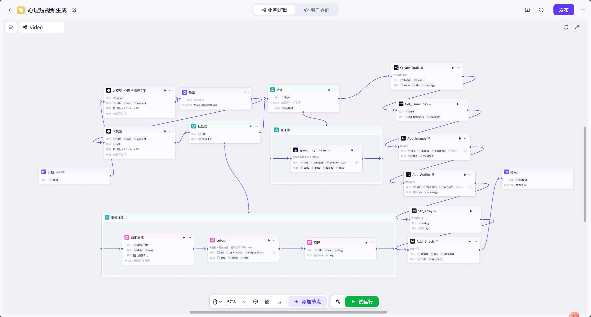
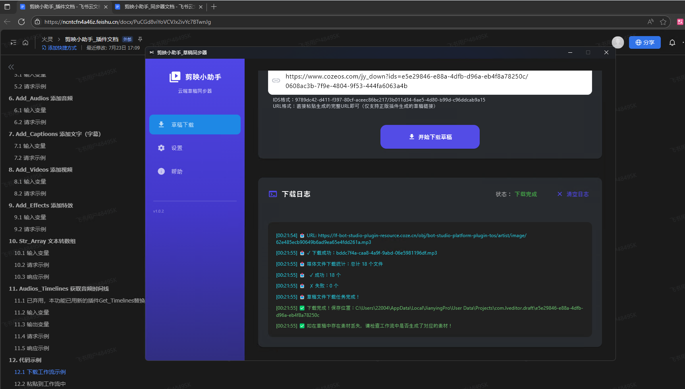

# PsycheFlowGen
AI工作流生成抖音爆款心理知识短视频（AI generates short videos of psychological knowledge）
[](https://deepwiki.com/Xikcn/PsycheFlowGen)


## 本项目展示
https://github.com/user-attachments/assets/a076865c-08f9-438f-8246-db5ff04c2433

## 项目简介
PsycheFlowGen 利用大语言模型（ChatDeepSeek）和 ComfyUI，自动生成心理学知识短视频的文案、分镜、配图、配音，并合成最终视频，适用于抖音等短视频平台。

## 新项目（漫画转短视频）
https://github.com/Xikcn/ComicFlow-Engine

具体效果（可见youtube作品）：https://youtu.be/wBCupT1kJes

1. 可以采用阿里的CosyVoice代替edgetts，可以使用更好的音色体验。
2. 采用其他图片生成模型也能得到更好体验，由于本机是6G显存因此图片效果一般，因此运行txt2video中脚本，可直接自己上传图片，代替comfyui生成，
详细使用流程，可见网页说明。
3. ...

## 功能特点
- 自动生成主题文案并摘要提取关键词
- 自动分镜策划和黑白火柴人风格英文正向/负向提示词
- 基于 ComfyUI 实现图像生成
- 基于 edge-tts 实现中文语音合成
- 通过 moviepy 合成视频并输出 MP4 文件

## 目录结构
```
.
├── main.py                 # 主程序入口
├── txt2img.py              # 文本转图像模块
├── configs/
│   └── txt2stick.json      # ComfyUI 工作流配置
├── prompt/
│   ├── Generate_article.txt
│   └── Generating_sub_mirror.txt
├── .gitignore              # 忽略文件
├── README.md               # 项目说明
└── output/                 # 生成的图片、音频和视频
```

## 环境要求
- Python 3.8+
- 操作系统：Windows/Mac/Linux 均可
- 依赖库见 requirements.txt

## 安装依赖
建议创建虚拟环境后安装依赖：
```bash
python -m venv venv
# Windows: venv\Scripts\activate  或  source venv/bin/activate
pip install -r requirements.txt
```

## 环境变量配置
在项目根目录新建 `.env` 文件，示例内容：
```
MODEL_NAME=your_llm_model_name
WORK_URL=http://localhost:8188/prompt
OUTPUT_DIR=./output
WORK_PATH=./configs/txt2stick.json
VOICE_MODEL=zh-CN-XiaoxiaoNeural
```

- `MODEL_NAME`：调用的 LLM 模型名称
- `WORK_URL`：ComfyUI 接口地址
- `OUTPUT_DIR`：图片、音频和视频输出目录
- `WORK_PATH`：ComfyUI 工作流配置文件路径
- `VOICE_MODEL`：edge-tts 可用的声音模型名称

## 使用方法
运行主程序并按照提示执行：
```bash
python main.py
```

## 输出说明
- 程序执行后会在 `output/` 目录下生成：
  - `cover.mp3` / `cover_frame.png`：封面配音及帧
  - `frame_X.png` / `scene_X.mp3`：每个分镜的图像和配音
  - `主题_镜头数.mp4`：最终合成的视频文件

### 本项目只用于学习，想要实际进行副业建议使用coze+剪映小助手


#### coze实际效果
https://github.com/user-attachments/assets/1cb60c74-db02-419c-a0a0-d04ba7aeeb22


## 许可证
MIT License


